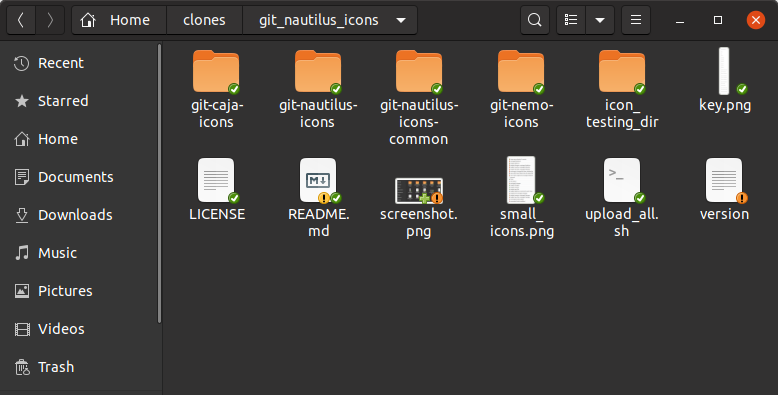
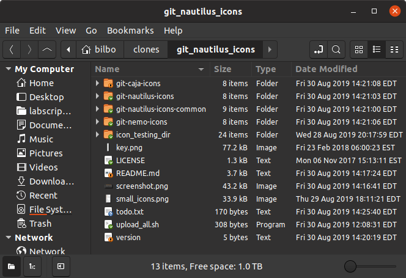
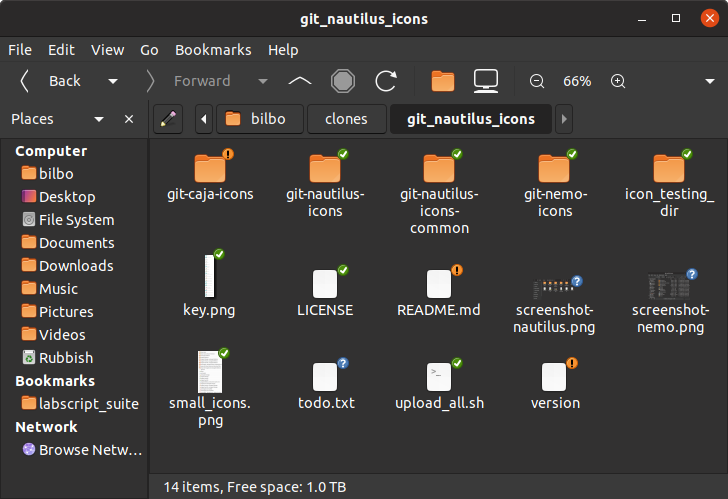
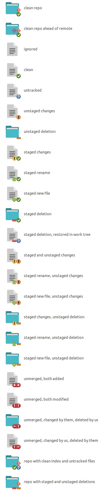
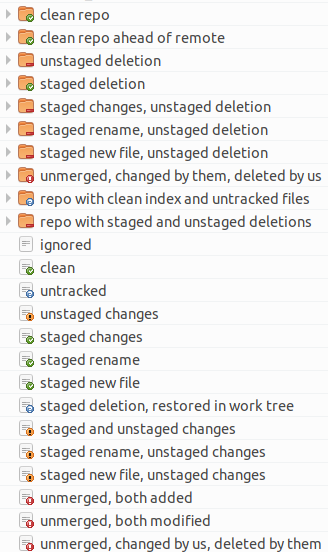

# git-nautilus-icons

Use Git? Use nautilus, nemo or caja? Why not have your file browser give you info
about your repos?

`git-nautilus-icons` overlays emblems saying whether files are modified, added,
untracked etc, with a high level of detail showing the exact git status of each file
including both staged and unstaged changes separately. It marks git repos as such and
displays icons on them showing whether they have changed files, unpushed commits, etc.
When using very small icons in nautilus, only icons for unstaged changes are shown, as
the more detailed information would not be visible at such a small size.

## Screenshots

### nautilus



### nemo



### caja




## Installation

Installation instructions for various distros follow. After installation, restart
nautilus/nemo/caja with `killall {nautilus,nemo,caja}`, and then the plugin will be
loaded next time nautilus/nemo/caja is run.

### Debian-based
   

In Debian-based distros, install the required dependencies using `apt`, then install the
plugin with `pip`. In the below commands, replace `{nautilus,nemo,caja}` with the
file browser(s) you want the plugin to work with.

### Older distros (Ubuntu < 20.04, Debian 10 ("buster") or earlier)

These older distros use Python 2-based extensions for nautilus, nemo and caja:

```bash
sudo apt-get install python-gi python-{nautilus,nemo,caja} python-pathlib python-enum34 python-pip
pip install --user git-nautilus-icons
# To uninstall, run:
# pip uninstall git-nautilus-icons
```

### Newer distros (Ubuntu >= 20.04, Debian sid, to become Debian 11 ("bullseye") or later)

These newer distros use Python 3 based extensions for nautilus, nemo, and caja:

```bash
sudo apt-get install python3-gi python3-{nautilus,nemo,caja} python3-pip
pip3 install --user git-nautilus-icons
# To uninstall, run:
# pip3 uninstall git-nautilus-icons
```
---


### Arch-based

 

In Arch-based distros, use the AUR packages:

[`git-nautilus-icons`](https://aur.archlinux.org/packages/git-nautilus-icons/)<sup>AUR</sup>
 or [`git-nautilus-icons-git`](https://aur.archlinux.org/packages/git-nautilus-icons-git/)<sup>AUR</sup>

The additional dependencies required for running with nautilus, nemo, or caja are listed
as optional dependencies of the AUR package.

### Other distros


If the version of nautilus, nemo, or caja shipped by your distro supports Python 3
extensions, then install the Python 3 GObject introspection package, possibly named
named `python3-gi` or `python3-gobject`, and the Python 3 extension module for
nautilus/nemo/caja, likely called `python3-{nautilus,nemo,caja}`. Ensure you have the
Python 3 version of `pip` installed, and then run (replacing `{nautilus,nemo,caja}` with
the file browser you want to install the extension for):

```bash
pip3 install --user git-nautilus-icons
```

Note that on some distros, `python3` is named `python` and `pip3` is named `pip`.
 
If the version of nautilus, nemo, or caja shipped by your distro only supports Python 2
extensions, then you additionally require the Python 2 `pathlib` and `enum34` packages,
likely called `python-pathlib` and `python-enum34`. Then the instructions are the same
as above except with the Python 2 versions of the GObject introspection library, file
browser extension support, and pip.

If you know the required dependencies for your distro, please file an issue or a pull
request for this project and I will update these instructions to include them.

## Icon key

Here is what each possible file status looks like, as well as a few examples of what
repositories may look like. Folders and repositories are marked with the status of their
contents, with the 'worst' status in the index and work tree shown (not necessarily from
the same file). For files deleted from the work tree, their status will only be visible
via their parent directory, so this is how they are shown below. Repos are also marked
with whether or not they are ahead of remote.



## Simplified icons at small sizes

---
**NOTE**

This feature does not currently work at the smallest sizes due to there being no way
(that I know of) for an application to add 8x8 and 12x12 icons to the icon theme in a
theme-independent way. I have made a merge reqest to the [hicolor icon
theme](https://gitlab.freedesktop.org/xdg/default-icon-theme/merge_requests/1) that
would resolve the issue. In the meantime, if you want the simplified icons to work at
the smallest sizes, you may use the patched `index.theme` file from that merge request:
```bash
wget https://gitlab.freedesktop.org/chrisjbillington/default-icon-theme/raw/master/index.theme
sudo mv index.theme /usr/share/icons/hicolor/index.theme
```
---

At small file icon sizes (16x16, 24x24, and 32x32), there is not enough room to show detailed
information for each file and simplified icons are shown instead, displaying only the
working tree status of each file, folder, or repository. These icon sizes are only
available in the list/tree view of nautilus. Here is what that looks like for the
smallest icon size in nautilus:



## Blacklisting

You can blacklist repositories or directories, to tell `git-nautilus-icons` not to check
git statuses there. This could be useful in the case of an extremely large repository
where calling `git status` is slow and so the extension slows down browsing in nautilus.
Git calls by this extension are asynchronous and so do not cause the file browser to
hang, but nautilus/nemo/caja can be slow to render large numbers of emblems.

To blacklist a repository or directory, add a line containing the full path to the
repository or directory to the file `$HOME/.config/git-nautilus-icons/blacklist.conf`.
Note that the path to this file is the same for all versions of the extension—there are
not separate blacklists for the nemo and caja versions of the extension.
`git-nautilus-icons` will ignore any files in blacklisted directories or any of their
subdirectories.

You will need to kill the file browser with `killall {nautilus,nemo,caja}` after
changing the blacklist, it will take effect when nautilus/nemo/caja is next run.

## Notes

Nautilus/nemo/caja doesn't always ask the extension for new icons when a file changes on
disk or its git status othewise changes, so displayed icons can be out of date. Press F5
to force a refresh.
