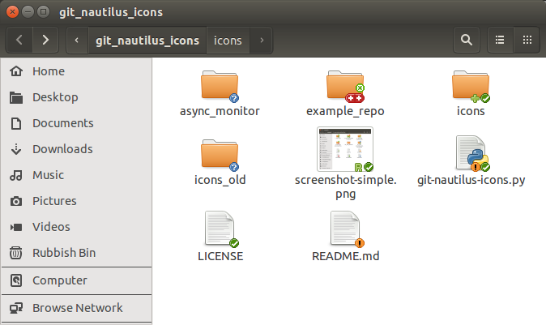

# git-nautilus-icons

Use Git? Use Nautilus? Why not have nautilus give you info about your repos?

`git-nautilus-icons` overlays emblems saying whether files are modified, added,
untracked etc. It marks git repos as such and displays icons on them showing
whether they have changed files, unpushed commits, etc.

Here are some examples of what some files and repos look like with the plugin
installed.

This in in 'simple' mode (enabled by default), which makes no distinction
staged and unstaged changes, they are simply marked as changed regardless:

And this is in 'full' mode, where changes in the index and changes in the work
tree are displayed separately, with index status on the left and work tree
status on the right. Unmerged files use two icons to show what type of merge
conflict it is, with the current branch on the left and the other branch on
the right. There is a fair bit of complexity in this mode and the icons are
much smaller, but much more detail is given.

## Installation

to install `git-nautilus-icons`, put the single python file
`git-nautilus-icons.py` in `~/.local/share/nautilus-python/extensions`,
and put the icons folder `hicolor` in `~/.icons/`. These directories might not
exist, in which case create them.

## Configuration

Note:  After changing configuration, you need to restart Nautilus for the
changes to take effect, which you can do by running `killall nautilus`.

### Switching between simple and full mode:
You can choose between the two modes by changing a variable at the top of
`git-nautilus-icons.py`, `ICON_MODE`, which you can set to either `'simple'`
or `'full'`.

You can blacklist repositories, to tell `git-nautilus-icons` not to check
their status. This could be useful in the case of an extremely large
repository where calling `git status` is slow and so the extension slows down
browsing in Nautilus. Git is pretty fast, so I haven't seen this, but I hear
such massive repos exist. Nautilus can also be pretty slow rendering those
icons, so even if your repo is not that big, you may wish to blacklist one if
you have a large number of files in a single folder and it slows Nautilus down
enough.

## Notes

Icons are updated every time you browse to a directory, but whilst in a
directory, Nautilus doesn't ask the extension for new icons unless it sees a
file change on disk. Tap F5 in Nautilius to force a refresh.
