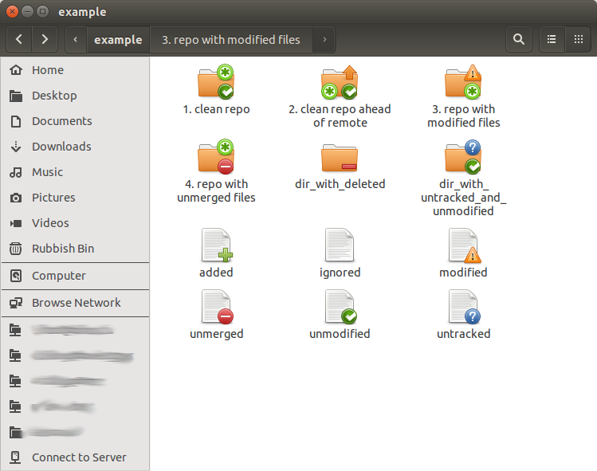

# git-nautilus-icons

Use Git? Use Nautilus? Why not have nautilus give you info about your repos?

git-nautilus-icons overlays emblems saying wither files are modified, added,
untracked etc. It marks git repos as such and displays icons on them showing
whether they have changed files, unpushed commits, etc.

Here are some examples of what some files and repos look like with the plugin
installed:



## Installation

to install `git-nautilus-icons`, put the single python file `git-nautilus-icons.py` in `~/.local/share/nautilus-python/extensions`.

The following should do it:

```
$ wget https://raw.github.com/chrisjbillington/git_nautilus_icons/master/git-nautilus-icons.png ~/.local/share/nautilus-python/extensions
```

## Notes

At the moment this extension makes no distinction between staged and unstaged
changes. If a change is staged but not committed, this appears the same as if
the change was unstaged. I'm working on a version that makes this distinction
and puts little two-part icons on files, one for their status in the index and
one for their status in the working tree, so watch this space.

Also, `git-nautilus-icons` makes a `git status` call every time nautilus
enters a folder in a git repo, and for every git repo it encounters in a
folder. Git is fast, so this is fine for all but the most gargantuan repos. If
you happen to have such a repo, you can blacklist it by adding it to the
`BLACKLIST` variable at the top of `git-nautilus-icons.py`. Then `git-
nautilus-icons` will not treat those folders at git repos. (I'm working on a
version based on `inotify` that will only call `git status` when files have
changed, so be on the lookout for that if this thing is too slow for your
oversized repos)

Even if git status calls are fast, sometimes if there are many files in a
single folder, Nautilus takes a long time to process all those icons. Whilst
this isn't really the fault of `git-nautilus-icons`, nonetheless I can
probably make it remember what it told Nautilus last time it asked about a
file, and only tell it about the new icon if things have changed. So likewise
if this is a problem, blacklist the repo and watch this space for a version
that does this more efficiently.
