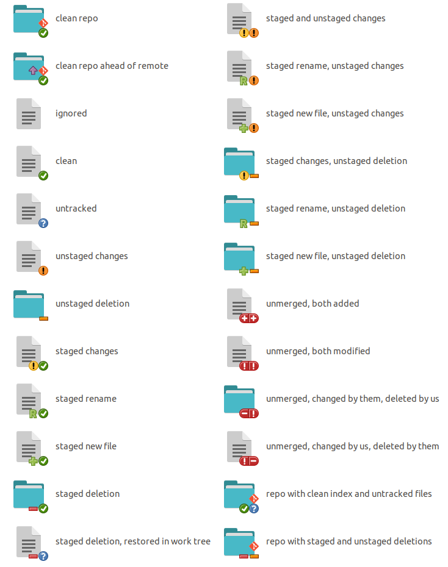

# git-nautilus-icons

Use Git? Use Nautilus, Nemo or Caja? Why not have your file browser give you info
about your repos?

`git-nautilus-icons` overlays emblems saying whether files are modified, added,
untracked etc, with a high level of detail showing the exact git status of each file
including both staged and unstaged changes separately. It marks git repos as such and
displays icons on them showing whether they have changed files, unpushed commits, etc.
When using very small icons in Nautilus, only icons for unstaged changes are shown, as
the more detailed information would not be visible at such a small size.

## Screenshots

### Nautilus


### Nemo


### Caja


## Installation

Installation instructions or various distros follow. After installation, restart
Nautilus/Nemo/Caja with `killall {nautilus,nemo,caja}`, and then the plugin will be
loaded next time Nautilus/Nemo/Caja is run.

### Debian-based
   

In Debian-based distros, install the required dependencies using `apt`, then install the
plugin with `pip`. In the below commands, replace `{nautilus,nemo,caja}` with the
specific file browser you want to install the plugin for.

```bash
sudo apt-get install python-gi python-{nautilus,nemo,caja} python-pathlib python-enum34 python-pip
sudo pip install git-{nautilus,nemo,caja}-icons
# To uninstall, run:
# sudo pip uninstall git-{nautilus,nemo,caja}-icons git-nautilus-icons-common
```

Note: the required dependencies will change in the future as these distros move to
building Nautilus/Nemo/Caja python plugin support with Python 3 instead of Python 2. If
you are from the future and I have forgotten to update these instructions after this has
occurred, the following should work:

```bash
sudo apt-get install python3-gi python3-{nautilus,nemo,caja} python3-pip
sudo pip3 install git-{nautilus,nemo,caja}-icons
# To uninstall, run:
# sudo pip3 uninstall git-{nautilus,nemo,caja}-icons git-nautilus-icons-common
```

### Arch-based

 

In Arch-based distros, use the AUR packages:

[`git-nautilus-icons`](https://aur.archlinux.org/pkgbase/git-nautilus-icons/)<sup>AUR</sup>
[`git-nautilus-icons-py2`](https://aur.archlinux.org/pkgbase/git-nautilus-icons-py2/)<sup>AUR</sup>
[`git-nemo-icons`](https://aur.archlinux.org/pkgbase/git-nemo-icons/)<sup>AUR</sup>
[`git-caja-icons-py2`](https://aur.archlinux.org/pkgbase/git-caja-icons-py2/)<sup>AUR</sup>


Note that Nautilus on Arch currently supports Python 2 or Python 3 extensions, but not
both at the same time. If you are running other Nautilus extensions that require Python
2, you will need to install the `-py2` AUR package. Otherwise, or if in doubt, install
the Python 3 version: `git-nautilus-icons`.

At present, Caja on Arch only supports Python 2 extensions, and Nemo only supports
Python 3 extensions. Caja will [likely change to
support](https://bugs.archlinux.org/task/62919) Python 3 extensions in the future, at
which point I will make a `git-caja-icons` AUR package. Please file an issue or comment
on the AUR package page to remind me to do this if I forget.

### Other distros


If the version of Nautilus, Nemo, or Caja shipped by your distro supports Python 3
extensions, then install the Python 3 GObject introspection package, possibly named
named `python3-gi` or `python3-gobject`, and the Python 3 extension module for
Nautilus/Nemo/Caja, likely called `python3-{nautilus,nemo,caja}`. Ensure you have the
Python 3 version of `pip` installed, and then run (replacing `{nautilus,nemo,caja}` with
the file browser you want to install the extension for):

```bash
sudo pip3 install git-{nautilus,nemo,caja}-icons
```

Note that on some distros, `python3` is named `python` and `pip3` is named `pip`.
 
If the version of Nautilus, Nemo, or Caja shipped by your distro only supports Python 2
extensions, then you additionally require the Python 2 `pathlib` and `enum34` packages,
likely called `python-pathlib` and `python-enum34`. Then the instructions are the same
as above except with the Python 2 versions of the GObject introspection library, file
browser extension support, and pip.

If you know the required dependencies for your distro, please file an issue or a pull
request for this project and I will update these instructions to include them.

## Icon key

Here is what each possible file status looks like, as well as a few examples of what
repositories may look like. Folders and repositories are marked with the status of their
contents, with the 'worst' status in the index and work tree shown (not necessarily from
the same file). For files deleted from the work tree, their status will only be visible
via their parent directory, so this is how they are shown below. Repos are also marked
with whether or not they are ahead of remote.



## Simplified icons at small sizes

At small file icon sizes (16x16 and 32x32), there is not enough room to show detailed
information for each file and simplified icons are shown instead, displaying only the
working tree status of each file, folder, or repository. These icon sizes are only
available in the list/tree view of Nautilus. Here is what that looks like for the
smallest icon size in Nautilus:


## Blacklisting

You can blacklist repositories or directories, to tell `git-nautilus-icons` not to check
git statuses there. This could be useful in the case of an extremely large repository
where calling `git status` is slow and so the extension slows down browsing in Nautilus.
Git calls by this extension are asynchronous and so do not cause the file browser to
hang, but Nautilus/Nemo/Caja can be slow to render large numbers of emblems.

To blacklist a repository or directory, add a line containing the full path to the
repository or directory to the file `$HOME/.config/git-nautilus-icons/blacklist.conf`.
Note that the path to this file is the same for all versions of the extension—there are
not separate blacklists for the Nemo and Caja versions of the extension.
`git-nautilus-icons` will ignore any files in blacklisted directories or any of their
subdirectories.

You will need to kill the file browser with `killall {nautilus,nemo,caja}` after
changing the blacklist, it will take effect when Nautilus/Nemo/Caja is next run.

## Notes

Icons are updated every time you browse to a directory, but whilst in a directory,
Nautilus/Nemo/Caja doesn't ask the extension for new icons unless it sees a file change
on disk, and even then it seems to not always notice. Press F5 to force a refresh.
